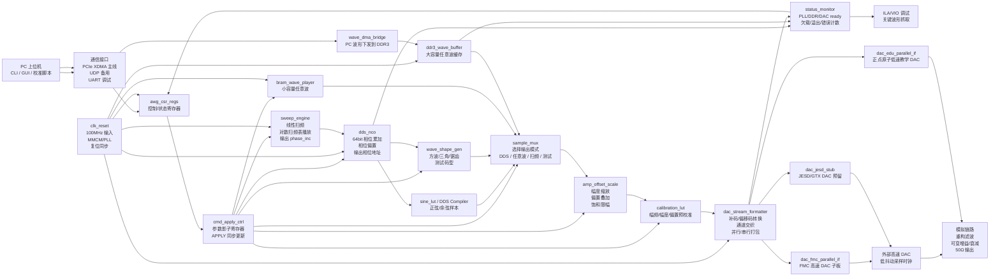
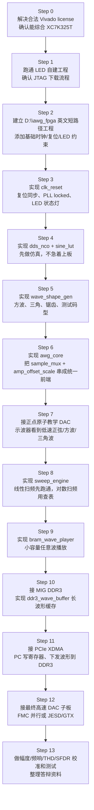

# K325T AWG FPGA Module Flowchart

本文档用于按图推进 FPGA 侧开发。第一张图看“信号在 FPGA 里怎么流”，第二张图看“开发顺序怎么一步一步做”。

当前已经实现的统一前端是 `D:\awg_fpga\rtl\dsp\awg_core.v`：它把 DDS、波形选择、幅度、偏置和限幅封装成一个模块，并由 `D:\awg_fpga\rtl\top\awg_dds_led_top.v` 直接实例化。

## 1. FPGA 内部模块流程图



### 这张图怎么读

1. PC 只负责发命令和下载波形，不直接参与高速实时输出。
2. `awg_csr_regs` 保存参数，`cmd_apply_ctrl` 负责让参数在安全边界一次性生效。
3. `sweep_engine` 不直接产生波形，它改变 DDS 的 `phase_inc`，从而实现扫频。
4. DDS、方波/三角波、任意波播放器都会进入 `sample_mux`。
5. 所有波形统一经过幅度、偏置、校准，再进入 DAC 格式化模块。
6. 最终 DAC 接口可以先用教学 DAC 验证，后续换成 FMC 高速 DAC 或 JESD/GTX DAC。

## 2. 开发顺序流程图



## 3. 每一步的上板验收点

| 顺序 | 模块 | 先看什么现象 | 通过标准 |
|---:|---|---|---|
| 0 | Vivado license | `Run Synthesis` 不再报 `Common 17-345` | 能生成自写 bitstream |
| 1 | LED 工程 | LED 随按键或计数变化 | JTAG 下载正常 |
| 2 | `clk_reset` | LED 显示 PLL locked / reset 状态 | 复位释放稳定 |
| 3 | `dds_nco` | 仿真样本周期变化 | 改 `phase_inc` 后频率变化 |
| 4 | `wave_shape_gen` | 仿真方波/三角/锯齿 | 波形形状正确 |
| 5 | `amp_offset_scale` | 仿真幅度和偏置变化 | 不溢出，能饱和限幅 |
| 5.5 | `awg_core` | 参考链路逐拍对拍 | `sample_mux` / `amp_offset_scale` 封装后一致 |
| 6 | 教学 DAC | 示波器看到低速波形 | 频率和幅度可调 |
| 7 | `sweep_engine` | 示波器/频谱仪看到扫频 | 起止频率、驻留时间正确 |
| 8 | `bram_wave_player` | 播放固定任意波表 | 周期连续，无跳变 |
| 9 | DDR3 | `ddr_ready=1`，FIFO 不欠载 | 长波形连续播放 |
| 10 | PCIe XDMA | PC 能读写寄存器和 DDR3 | 上位机命令控制输出 |
| 11 | 高速 DAC | 输出高频正弦 | 进入指标测试 |
| 12 | 校准测试 | 记录 Vpp、THD、SFDR、平坦度 | 可支撑比赛答辩 |

## 4. 最小可运行主线

如果时间紧，优先做这条主线：

```text
license -> LED -> clk_reset -> DDS -> amp_offset_scale -> 教学 DAC -> sweep_engine -> BRAM 任意波 -> 答辩演示
```

如果时间和硬件允许，再补强：

```text
DDR3 -> PCIe XDMA -> 高速 DAC -> 校准表 -> 完整指标测试
```

## 5. 当前最关键提醒

1. license 没解决前，所有自写 RTL 都不能生成新的 K325T bitstream。
2. 教学 DAC 只能验证流程，不能代表最终 5GSa/s、14bit、1GHz 指标。
3. 最终高速 DAC 的接口选型会决定 `dac_fmc_parallel_if` 还是 `dac_jesd_stub` 是主线。
4. FPGA 内部模块一定要先仿真，再上板，否则调试成本会非常高。


## Current implementation note (2026-05-06)

- The practical first-iteration board chain is now:
  `sys_clk_p/n -> awg_key_ui_ctrl -> awg_core -> dac_edu_parallel_if -> teaching DAC`
- `KEY0` and `KEY1` are active in the current demo for mode/parameter control.
- The current demo bitstream is:
  `D:\awg_fpga\vivado\awg_k325t.runs\impl_1\awg_dds_led_top.bit`
- Keep the JESD/GTX high-speed DAC path as the phase-2 route, not the first bring-up path.