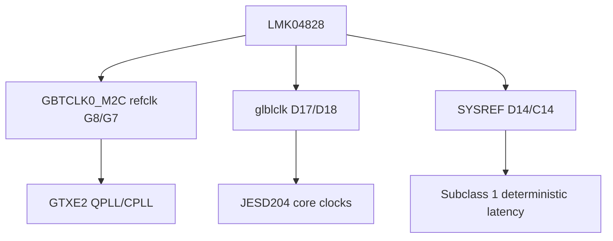

# 时钟树

## K325T 基础时钟

```text
sys_clk_p/n (AE10/AF10, 100 MHz differential)
  -> IBUFDS
  -> BUFG
  -> system clk
```

Verilog 必须使用差分输入缓冲：

```verilog
IBUFDS clk_ibufds (
    .I  (sys_clk_p),
    .IB (sys_clk_n),
    .O  (clk_ibuf)
);

BUFG clk_bufg (
    .I (clk_ibuf),
    .O (clk)
);
```

## AD9144/JESD 时钟

FMCADDA 子卡通过 LMK04828 提供 JESD 所需时钟：



## 当前风险

2026-05-06 routed timing 仍未收敛：

```text
WNS = -3.157 ns
TNS = -235.311 ns
```

主要风险不是 GT lane 本身，而是 reset/debug/cross-clock-domain 路径。license 阻塞解除后，需要先清理 [[时序与CDC风险]]，再进入可靠硬件验证。

