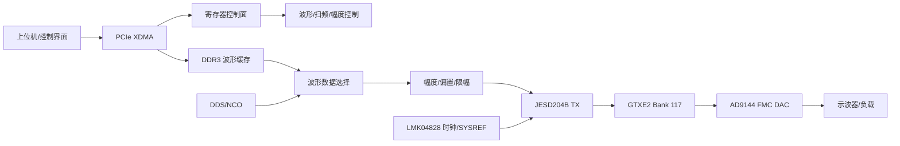
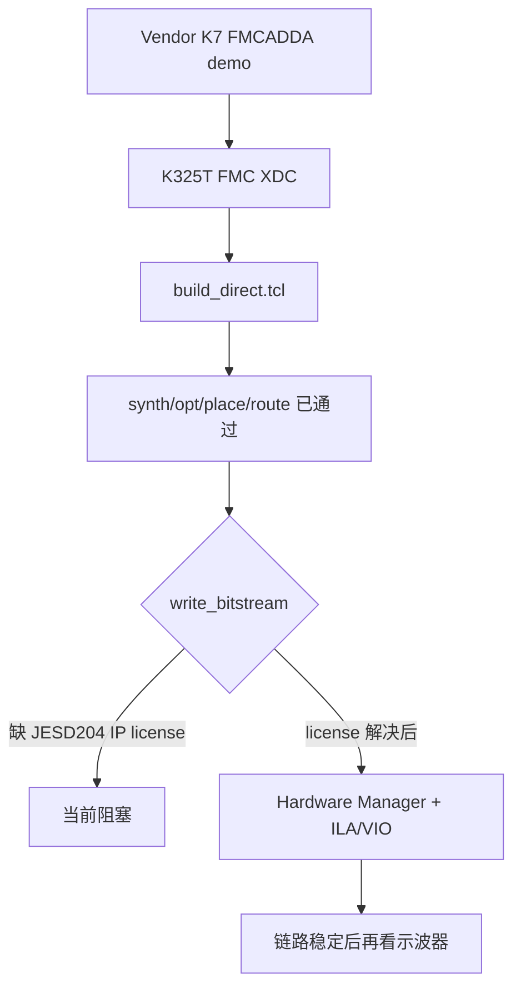

# 顶层架构图

## 最终目标架构

## 当前可执行架构

当前先使用 vendor demo 做 AD9144 standalone bring-up，不急着把它并入 `D:\awg_fpga` 主工程。

## 为什么不先改主工程

`D:\awg_fpga\rtl\top\awg_fmc_adda_top.v` 目前仍是骨架，尚未真正连接 JESD204 PHY。直接在主工程里改容易同时引入顶层、约束、IP、时序、硬件多类问题。正确路线是：

1. 先用 `D:\FPGA\ad9144_bringup_k325t` 证明 vendor demo 可以在 K325T 上建链。
2. 再把已验证的 XDC、reset、JESD status、数据入口迁入 `D:\awg_fpga`。
3. 最后替换 vendor ROM 数据为 AWG DDS/BRAM/DDR 数据。

## 关联笔记

- [[AD9144 Bring-Up]]
- [[JESD204数据链路]]
- [[开发路线图]]
- [[时序与CDC风险]]

