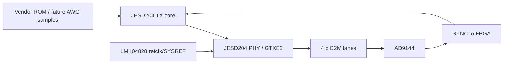

# JESD204 数据链路

## 当前状态

JESD204 vendor demo 已能完成综合、优化、布局、布线，但无法生成 bitstream。原因是缺少 Xilinx JESD204 LogiCORE 的 bitstream 授权，不是 K325T 器件 license、XDC 或 FMC 引脚错误。

错误原文见 [[License与JESD204授权]]。

## 链路目标



## 高速 lane 映射

| FMC signal | FPGA pins | Bank117 | 用途 |
|---|---|---|---|
| DP0_C2M_P/N | H2 / H1 | TX2 | DAC lane 0 |
| DP1_C2M_P/N | F2 / F1 | TX3 | DAC lane 1 |
| DP2_C2M_P/N | J4 / J3 | TX1 | DAC lane 2 |
| DP3_C2M_P/N | K2 / K1 | TX0 | DAC lane 3 |
| GBTCLK0_M2C_P/N | G8 / G7 | CLK0 | GTX refclk |

## 建链顺序

```text
1. LMK04828 SPI 配置
2. AD9144 SPI 配置
3. GTX refclk / QPLL lock
4. 释放 JESD204 TX reset
5. 等待 SYNC/SYSREF
6. TX tready 拉高
7. 发送 vendor ROM sample data
8. ILA 状态正常后再检查模拟输出
```

## ILA 最小检查项

| 信号 | 期望 |
|---|---|
| QPLL lock | 1 |
| TX reset done | 1 |
| TX tready | 1 |
| AD9144 SYNC status | 稳定 |
| SYSREF | 有活动 |
| TX sample data | 变化，不是全 0 |

## 不要做的事

- 不要在没有 bitstream 的情况下纠结示波器为什么没有波形。
- 不要把 `[Common 17-69]` 当成普通 K325T license 报错。
- 不要直接把 vendor `top.xdc` 用到 K325T，它不是本板的 FMC/GT 映射。

## 关联笔记

- [[AD9144 Bring-Up]]
- [[FMC引脚速查]]
- [[License与JESD204授权]]
- [[硬件验证流程]]

