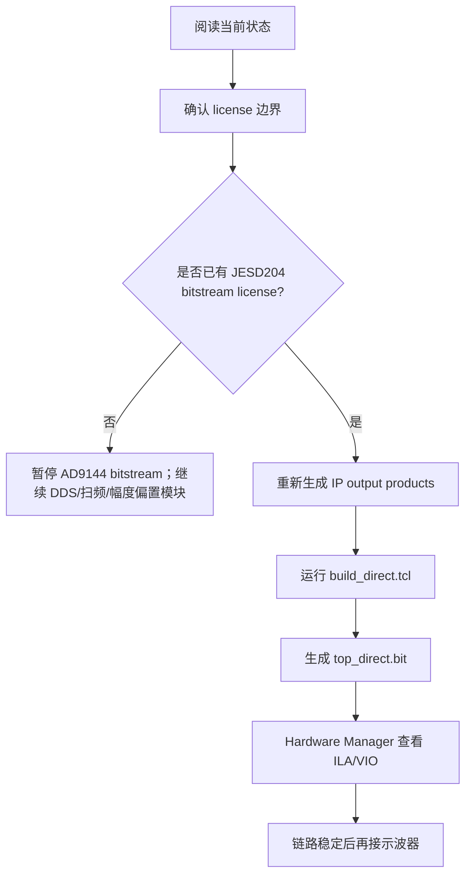

# K325T AWG 项目笔记

本 vault 是研电赛优利德赛题二 AWG 项目的工程笔记。打开 Obsidian 后先看本页，再进入 [[当前状态]] 和 [[License与JESD204授权]]。

## 当前结论

| 事项 | 状态 | 说明 |
|---|---|---|
| K325T Synthesis/Implementation license | 可用 | `trial.lic` 已验证到 `K325T_SYNTHESIS_TEST_OK` |
| DDS LED 工程 | 已生成 bit | 路径见 [[DDS波形生成]] |
| AD9144 standalone 工程 | 综合/布局/布线通过 | 见 [[AD9144 Bring-Up]] |
| AD9144 bitstream | 阻塞 | 缺 JESD204 LogiCORE bitstream 授权 |
| 示波器看 AD9144 输出 | 暂缓 | 先解决 license 并用 ILA 验证链路 |

## 快速入口

- [[当前状态]]：今天能做什么、卡在哪里。
- [[开发路线图]]：从 LED 到 AD9144、PCIe、DDR3 的阶段计划。
- [[顶层架构图]]：系统模块关系和数据流。
- [[JESD204数据链路]]：AD9144 通路、license 边界、ILA 检查。
- [[FMC引脚速查]]：K325T FMC HPC 高速和低速引脚。
- [[K325T约束速查]]：XDC 约束怎么写、从哪里查。
- [[Vivado常见错误]]：常见错误和处理方式。
- [[路径与文件索引]]：所有关键工程、脚本、报告和资料路径。

## 建议工作流

## 外部权威文档

- 项目 handoff 主文档：`D:\FPGA\AGENTS.md`
- 正点原子 FPGA 开发指南：`D:\FPGA\Kintex7\Kintex7\2_文档教程\【正点原子】Kintex7之FPGA开发指南V1.3.pdf`
- K7 底板原理图：`D:\FPGA\Kintex7\Kintex7\3_开发板原理图\K7_BASE_1V3_2025_0111_USER.pdf`
- K7 IO 约束参考：`D:\FPGA\Kintex7\Kintex7\3_开发板原理图\K7_IO.xdc`
- AD9144 bring-up 包：`D:\FPGA\ad9144_bringup_k325t`
